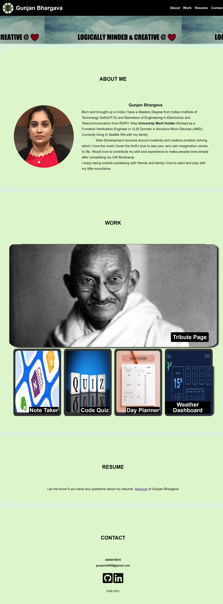

# Portfolio

This is my professional portfolio demonstrating my core skills in Flexbox, Media Queries, and CSS variables.

## Key Learning:

1. Usage of Flexbox for responsive web design.
2. Media Queries for small, medium and large screen.
3. Usage of semantic HTML elements and logical structuring of web page.
4. Learned attributes of html elements.
5. Consolidating redundant CSS and CSS layout.
6. Usage of Github (uploading and publishing on github).

## ScreenShot

## Deployed Application

[Portfolio]()
