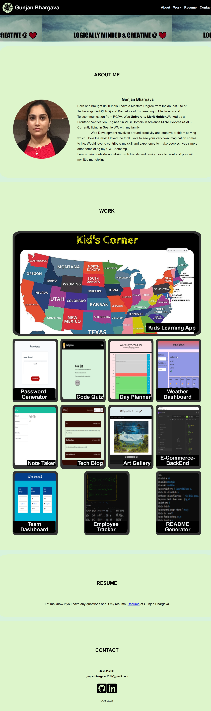

# Portfolio

This is my professional portfolio demonstrating my core skills in Flexbox, Media Queries, CSS variables, javascript, jQuery, Moment.js, Bootstrap, local storage,UIkit, and WebServer APIs.

## Key Learning:

- Usage of Flexbox for responsive web design.
- Media Queries for small, medium and large screen.
- Usage of semantic HTML elements and logical structuring of web page.
- Learned attributes of html elements.
- Consolidating redundant CSS and CSS layout.
- Javascript,jQuery.
- Moment.js
- Bootstrap,UIkit CSSFramework.
- WebServer APIs.
- Packages like-:

  - Nodemon
  - Path
  - Express
  - Express-session
  - Express-handlebars
  - mysql2
  - dotenv
  - bcrypt
  - sequelize (ORM)
  - connect-session-sequelize
  - multer
  - cloudinary
  - multer-storage-cloudinary
  - paypal-rest-sdk

- Google Fonts
- Font Awesome
- Usage of Github (uploading and publishing on github, heroku).

## ScreenShot

## Deployed Application

[Portfolio](https://gunjanb.github.io/Portfolio/)
